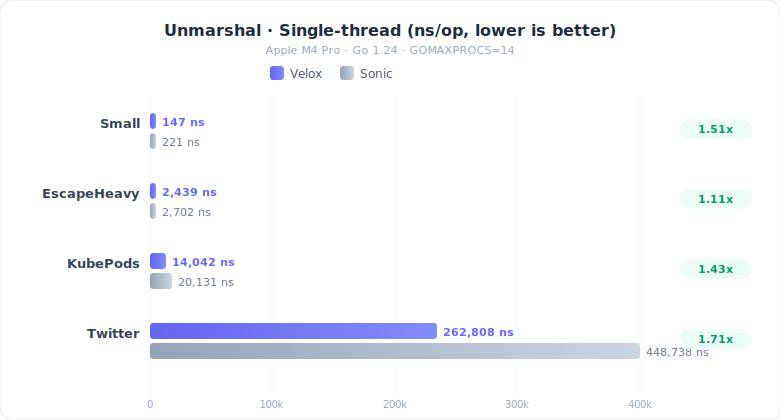
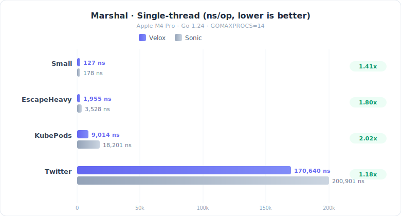

# Velox JSON (vjson)

Velox is a high-performance JSON encoder/decoder for Go.

- Single-pass decoding into Go values
- Pure Go implementation (no CGO), consistent across platforms
- Zero-copy strings when possible
- Low-allocation, GC-friendly design
- Fast struct decoding with cached type metadata
- Streaming `Decoder` API for `io.Reader`

## Install

```bash
go get github.com/velox-io/json@latest
```

## Quick start

### Unmarshal

```go
package main

import (
	"fmt"

	json "github.com/velox-io/json"
)

type User struct {
	ID   int    `json:"id"`
	Name string `json:"name"`
}

func main() {
	data := []byte(`{"id":1,"name":"alice"}`)

	var u User
	if err := json.Unmarshal(data, &u); err != nil {
		panic(err)
	}

	fmt.Printf("%+v\n", u)
}
```

#### Zero-copy note

`Unmarshal` may keep **string fields** referencing the input buffer for zero-copy decoding. Do **not** modify (or reuse/mutate) the `data` buffer after calling `Unmarshal`.

### Marshal

```go
package main

import (
	"fmt"

	json "github.com/velox-io/json"
)

type User struct {
	ID   int    `json:"id"`
	Name string `json:"name"`
}

func main() {
	u := User{ID: 1, Name: "alice"}

	b, err := json.Marshal(&u)
	if err != nil {
		panic(err)
	}

	fmt.Println(string(b))
}
```

#### Indented output

```go
b, err := json.MarshalIndent(&u, "", "  ")
```

#### Append to an existing buffer

```go
dst := make([]byte, 0, 1024)

dst, err := json.AppendMarshal(dst, &u)
```

#### Marshal options

- `WithEscapeHTML()` / `WithNoEscapeHTML()`

Example:

```go
b, err := json.Marshal(&u, json.WithEscapeHTML())
```

## Performance & benchmarks

Benchmark environment: **Apple M4 Pro**, Go 1.24, `GOMAXPROCS=14`

### Unmarshal (single-thread)

<p align="center"></p>

| Dataset | Library | ns/op | MB/s | B/op | allocs/op |
|---------|---------|------:|-----:|-----:|----------:|
| Small | Sonic | 221 | — | 276 | 4 |
| Small | **Velox** | **147** | — | **48** | **1** |
| EscapeHeavy | Sonic | 2702 | 1514 | 6337 | 10 |
| EscapeHeavy | **Velox** | **2439** | **1679** | **2988** | **4** |
| KubePods | Sonic | 20131 | 1268 | 39398 | 171 |
| KubePods | **Velox** | **14042** | **1817** | **12579** | **99** |
| Twitter | Sonic | 448738 | 1412 | 813018 | 1525 |
| Twitter | **Velox** | **262808** | **2403** | **167490** | **1018** |

### Marshal (single-thread)

<p align="center"></p>

| Dataset | Library | ns/op | B/op | allocs/op |
|---------|---------|------:|-----:|----------:|
| Small | Sonic | 178 | 128 | 2 |
| Small | **Velox** | **127** | **112** | **1** |
| EscapeHeavy | Sonic | 3528 | 3089 | 2 |
| EscapeHeavy | **Velox** | **1955** | **3072** | **1** |
| KubePods | Sonic | 18201 | 14178 | 8 |
| KubePods | **Velox** | **9014** | **13569** | **1** |
| Twitter | Sonic | 200901 | 272551 | 107 |
| Twitter | **Velox** | **170640** | **303114** | **1** |

---

Benchmark environment: **AMD EPYC 7K62 48-Core** (KVM, 8C/16T), Go 1.26rc3, `GOMAXPROCS=16`, Linux x86_64

### Unmarshal (single-thread)

| Dataset | Library | ns/op | MB/s | B/op | allocs/op |
|---------|---------|------:|-----:|-----:|----------:|
| Small | Sonic | 476 | — | 208 | 3 |
| Small | **Velox** | **530** | — | **48** | **1** |
| EscapeHeavy | Sonic | 7447 | 549 | 7169 | 10 |
| EscapeHeavy | **Velox** | **6793** | **602** | **2988** | **4** |
| KubePods | Sonic | 51002 | 501 | 45245 | 148 |
| KubePods | **Velox** | **41278** | **618** | **12579** | **99** |
| Twitter | Sonic | 879278 | 718 | 971513 | 1410 |
| Twitter | **Velox** | **748561** | **844** | **167517** | **1018** |

### Marshal (single-thread)

| Dataset | Library | ns/op | B/op | allocs/op |
|---------|---------|------:|-----:|----------:|
| Small | Sonic | 235 | 128 | 2 |
| Small | Velox | 441 | 112 | 1 |
| EscapeHeavy | Sonic | 3188 | 3093 | 2 |
| EscapeHeavy | Velox | 5665 | 3072 | 1 |
| KubePods | Sonic | 13364 | 14217 | 8 |
| KubePods | Velox | 29806 | 13570 | 1 |
| Twitter | Sonic | 187877 | 272928 | 108 |
| Twitter | Velox | 533803 | 303125 | 1 |

### Reproduce

```bash
cd benchmark
go test -bench="Benchmark(_Marshal)?_(Small|Twitter|EscapeHeavy|KubePods)_(Sonic|Velox)" -benchmem . -count=2
```

## Testing

```bash
make test
```

Fuzz targets:

```bash
make fuzz
# or customize duration
make fuzz FUZZ_TIME=2m
```

## Lint / formatting

```bash
make fmt
make lint
```


## License

[MIT](./LICENSE)
