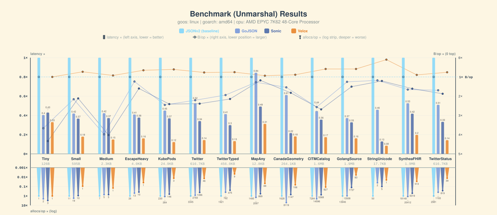
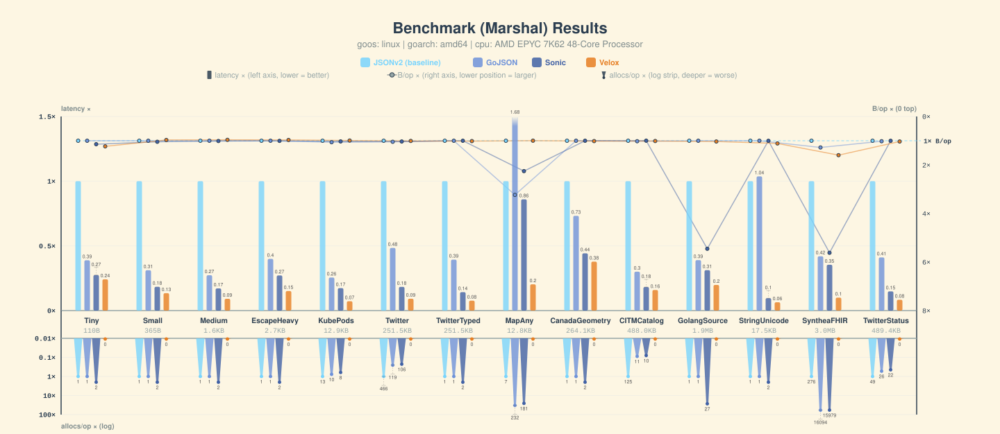

# Velox

Velox is a high-performance JSON library for Go.

## Performance




[docs/benchmarks](docs/benchmarks).

## Design

Velox focuses on **binding-style** conversion between JSON and typed Go values (`Unmarshal` and `Marshal`), targeting high throughput with few allocations. See [architecture](docs/arch_2_en.md).

## Compatibility

Velox follows `encoding/json` semantics on the common path:

- field tags: custom names, `-`, `,string`, `,omitempty`, `,omitzero`
- anonymous (embedded) structs, pointers, `json.Number`, `json.RawMessage`
- `json.Marshaler`/`json.Unmarshaler` and `encoding.TextMarshaler`/`TextUnmarshaler`
- boxing into `any` (`[]any`, `map[string]any`)
- unmarshal errors can be inspected with `errors.As` against the `encoding/json` error types

`omitzero` follows Go 1.24 `encoding/json` semantics: a field is skipped when
its value is zero, as decided by an `IsZero() bool` method if the field type or
its pointer implements one, otherwise by `reflect.Value.IsZero`. Unlike
`omitempty`, a nil slice or map is zero while an empty non-nil one is not.
`value.Value` and `stream.Stream` fields are always emitted.

```go
type Event struct {
    Name string    `json:"name"`
    At   time.Time `json:"at,omitzero"` // zero time → key absent
    Tags []string  `json:"tags,omitzero"` // nil → absent; empty non-nil → "tags":[]
}
```

Deliberate differences:

- **Case-sensitive field matching.**

  For performance, Velox deliberately matches field names by exact bytes rather than performing the case-insensitive matching supported by `encoding/json`.

- **Strict tag-option parsing.**

  A misspelled option such as `omitEmpty` or `omit_zero` fails the type's build with a message naming the canonical spelling, where `encoding/json` v1 silently ignores it. An embedded field whose tag carries options (other than `embed`) is likewise rejected rather than promoted with the options dropped.


### Requirements

- Golang Version: 1.24+
- Platform: `darwin/arm64`, `linux/amd64`, `linux/arm64`, `windows/amd64`.


## Zero-copy decoding

`Unmarshal` is zero-copy by default: escape-free strings alias the caller's input buffer. Escaped strings are copied because their decoded bytes differ from the input. The caller must preserve the input's bytes while any decoded value remains reachable:

```go
var pod KubePodList
err := json.Unmarshal(src, &pod) // pod's clean strings alias src
```

Pass `json.WithZeroCopy(false)` when the destination must own its bytes, for example when the input buffer is reused after decoding:

```go
var pod KubePodList
err := json.Unmarshal(src, &pod, json.WithZeroCopy(false)) // pod owns its strings
```

## Extensions

### `json.Value`

Velox provides `Value` for dynamic JSON and partial-access workloads where binding the entire document to a predefined Go type or `map[string]any` would be unnecessary. It is a tape-backed view for navigating parsed JSON directly:

```go
import json "github.com/velox-io/json"

doc, err := json.Parse(src)
if err != nil {
    return err
}

name, ok := doc.GetString("user", "name")
items := doc.Get("items")
first := items.Index(0)
id, ok := first.GetInt("id")
```

A `Value` can also appear anywhere in a typed destination and is populated directly by `Unmarshal`:

```go
type Envelope struct {
    Code int        `json:"code"`
    Data json.Value `json:"data"`
}

var envelope Envelope
err := json.Unmarshal(src, &envelope)
```

Tape-backed values have two representation limits:

- The JSON document must be smaller than 4 GiB;

- Decoded string or object key must be smaller than 16 MiB

  > [!TIP]
  > The string length limits apply to `Value`, not to ordinary Go `string` fields.

### Reserve unknown keys

A `Value` field tagged `json:",embed"` collects every key not matched by a named field:

```go
type Foo struct {
    Name string    `json:"name"`
    Exts json.Value `json:",embed"` // unmatched keys land here
}
```

### Polymorphic decoding

JSON has no sum types, but payloads often encode them: a discriminator field names the type and a sibling field carries the matching variant. Velox resolves that choice while scanning, so one pass produces the right Go value instead of a `json.RawMessage` you decode yourself. Two selectors are available:

- `vjson:"variant=<disc>"` picks the case from a sibling string field.
- `vjson:"kindof"` picks the case from the JSON value's own kind.

#### Selecting by a discriminator

The discriminator is a string field of the same struct; the variant field is `any` (or an interface) and holds the decoded case:

```go
type EventEnvelope struct {
    Type string `json:"type"`                       // the discriminator
    Data any    `json:"data" vjson:"variant=type"`  // whose type it selects
}

type User struct {
    Name string `json:"name"`
    Role string `json:"role"`
}

type Product struct {
    Title string `json:"title"`
    Price int    `json:"price"`
}
```

The case table is a struct type: each field is one case, and its type is what gets decoded. Register it once, before the first parse of the host type:

```go
func init() {
    vjson.DefineVariantCases[EventEnvelope, struct {
        _ User    `case:"user"`    // "user"    → User
        _ Product `case:"product"` // "product" → Product
    }]()
}
```

The case value is the descriptor field's name, so `User User` declares the case `"User"`. Use a blank field with a `case:"..."` tag when the discriminator value is not a Go identifier, as above. A blank field without a tag is the default case, used when no case matches; without one, an unmatched value is an error.

The call site stays an ordinary `Unmarshal` into the host. Afterwards `env.Data` holds the selected case as its concrete Go type:

```go
var env EventEnvelope
err := json.Unmarshal([]byte(`{"type":"user","data":{"name":"Alice","role":"admin"}}`), &env)
// env.Type == "user", env.Data == User{Name: "Alice", Role: "admin"}
```

Consume it with the usual Go idiom for a value of varying type:

```go
switch v := env.Data.(type) {
case User:
    fmt.Println(v.Name, v.Role)
case Product:
    fmt.Println(v.Title, v.Price)
}
```

The discriminator may appear after the value it selects: the scan buffers the value and resolves it when the host object closes. A discriminator carried by the input always wins over whatever the destination already held.

#### Selecting by JSON kind

When there is no discriminator, the value's first token is the answer. Declare the kinds you accept and their Go types:

```go
type Response struct {
    Data any `json:"data" vjson:"kindof"`
}

func init() {
    vjson.DefineKindofCases[Response, struct {
        bool   bool
        number float64
        string string
        array  []User
        object User
    }]()
}
```

`{"data":42.5}` yields `float64(42.5)`, `{"data":{"name":"Alice"}}` yields a `User`, and `{"data":null}` leaves the field nil. A kind you did not declare is an error. This is the tool for schemaless members, for example an error field that is a string in one response and an object in another.

#### Unfolding the case into the host

`json:",embed"` turns the variant into an inline one: instead of consuming one named member, the selected case's fields become members of the host object itself.

```go
type K8sObject struct {
    Kind   string `json:"kind"`
    Object any    `json:",embed" vjson:"variant=kind"`
}

func init() {
    vjson.DefineVariantCases[K8sObject, struct {
        _ PodObject     `case:"Pod"`     // contributes podSpec + podStatus
        _ ServiceObject `case:"Service"`
    }]()
}
```

`{"kind":"Pod","podSpec":{...},"podStatus":{...}}` selects `PodObject` and binds `podSpec` and `podStatus` into it, one discriminator driving several host fields at once. Inline cases must be structs, and a host has at most one inline variant.

#### Multiple polymorphic fields

A host may carry several sibling variants, each with its own discriminator and its own case set. Register an axis by its Go field name:

```go
vjson.DefineVariantCasesAt[K8sObject, struct {
    _ KubeletReport   `case:"kubelet"`
    _ SchedulerReport `case:"scheduler"`
}]("Report")
```

`DefineVariantCases` is the host-wide fallback used by every axis that has no field-specific registration.

As an alternative to registration, a host may declare its descriptor as the parameter of a `JSONVariantCases` method (or `JSONKindofCases` for kindof). The method is never called; it only carries the type. Pick one form per host, not both.

Example detail: [partial](examples/unmarshal/partial), [poly](examples/unmarshal/poly).

### Stream

A `vjson.Stream[T]` field consumes a large array element by element instead of materializing it as `[]T`. Declare it with the array's JSON key, register an `OnRead` handler before `Unmarshal`, and the parser hands the handler the elements as it reaches them:

```go
type Response struct {
    Users   vjson.Stream[User] `json:"users"`
    Message string             `json:"message"`
}

var resp Response
resp.Users.OnRead(func(users stream.Scope[User]) error { // stream.Scope[T] from github.com/velox-io/json/stream
    for item := range users.Iter() {
        if err := item.Decode(); err != nil { // binds one element
            return err
        }
        u := item.Target()
        fmt.Println(u.ID, u.Name)
    }
    return nil
})

if err := json.Unmarshal(src, &resp); err != nil {
    return err
}
fmt.Println(resp.Message) // fields around the stream bind as usual
```

Peak memory is one batch of elements rather than the whole array. Streaming here is element level, not byte level.
Example detail: [stream](examples/unmarshal/stream).

## Roadmap

See [ROADMAP.md](ROADMAP.md) for planned work.


## Acknowledgements

Thanks to the [simdjson](https://github.com/simdjson/simdjson) for the work on high-performance JSON parsing.

## License

[MIT](./LICENSE)
