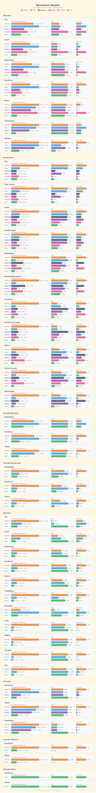
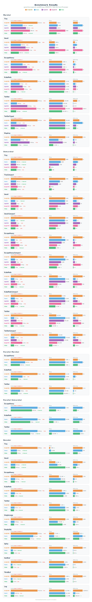

# Benchmarks

### Apple M4 Pro

Environment: **Apple M4 Pro**, Go 1.24, `GOMAXPROCS=14`

<p align="center"></p>

### AMD

Environment: **AMD EPYC 7K62 48-Core Processor**, x86_64, 8 cores / 16 threads, KVM virtualized

<p align="center"></p>

## Reproduce

```bash
make benchmark
```

