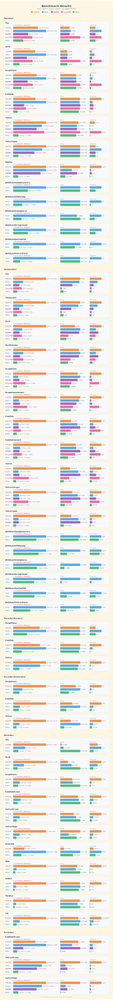
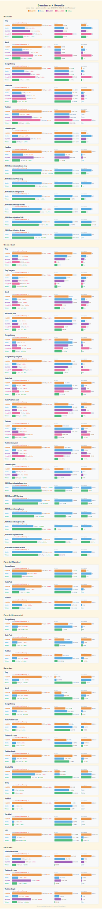
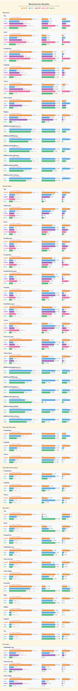
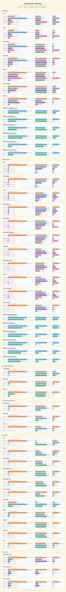

# Benchmarks

### Apple M4 Pro

Environment: **Apple M4 Pro**, Go 1.24, `GOMAXPROCS=14`

### AMD EPYC 7K62

Environment: Linux, **AMD EPYC 7K62 48-Core Processor**, x86_64, 8 cores / 16 threads, KVM virtualized

### Intel Xeon Gold 6133

Environment: Linux, **Intel(R) Xeon(R) Gold 6133 CPU @ 2.50GHz**, x86_64, 4 cores / 4 threads, 1 socket, KVM virtualized

### HiSilicon Kunpeng-920

Environment: Linux, **Kunpeng-920**, aarch64, 4 cores / 4 threads, 1 socket, L3 32 MB

## Test Data

| File | Description |
|------|-------------|
| [tiny.json](../benchmark/testdata/tiny.json) | Minimal flat object (5 fields, ~80 B) |
| [small.json](../benchmark/testdata/small.json) | Small mixed object with nested structs and arrays (~370 B) |
| [escape_heavy.json](../benchmark/testdata/escape_heavy.json) | String-heavy payload with many escape sequences |
| [kubepods.json](../benchmark/testdata/kubepods.json) | Kubernetes pod list (~500 KB) |
| [twitter.json](../benchmark/testdata/twitter.json) | Twitter timeline (~600 KB) |

