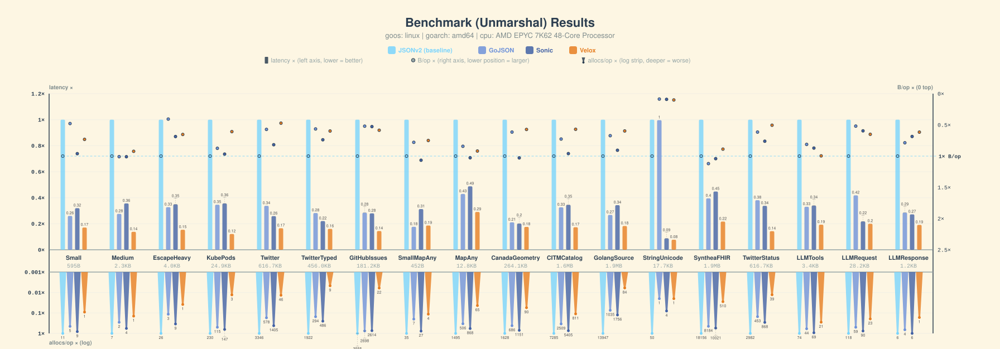
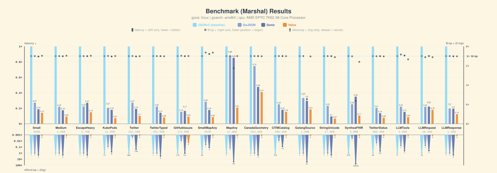
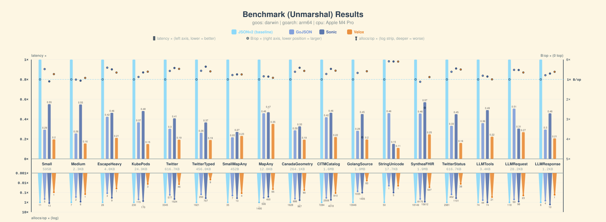
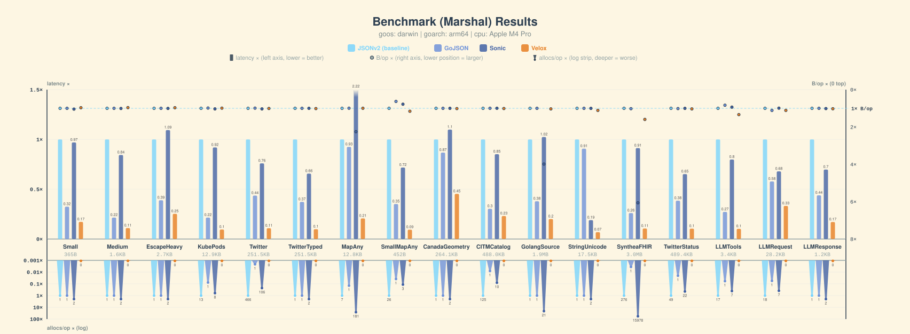

# Benchmarks

Charts plus raw `go test -bench` output, one directory per machine. Bars are
normalized against **JSONv2** (baseline = 1×, shorter is faster); the strip under
each group carries B/op and allocs/op. Compared libraries: Velox, Sonic,
GoJSON, JSONv2.

Add or refresh a machine from the repo root:

```bash
make benchviz
```

## linux-amd64

| suite | chart | raw |
| --- | --- | --- |
| Unmarshal | [unmarshal.svg](linux-amd64/unmarshal-4.svg) | [unmarshal.txt](linux-amd64/unmarshal-4.txt) |
| Marshal | [marshal.svg](linux-amd64/marshal-4.svg) | [marshal.txt](linux-amd64/marshal-4.txt) |




## darwin-arm64

| suite | chart | raw |
| --- | --- | --- |
| Unmarshal | [unmarshal.svg](darwin-arm64/unmarshal-4.svg) | [unmarshal.txt](darwin-arm64/unmarshal-4.txt) |
| Marshal | [marshal.svg](darwin-arm64/marshal-4.svg) | [marshal.txt](darwin-arm64/marshal-4.txt) |




